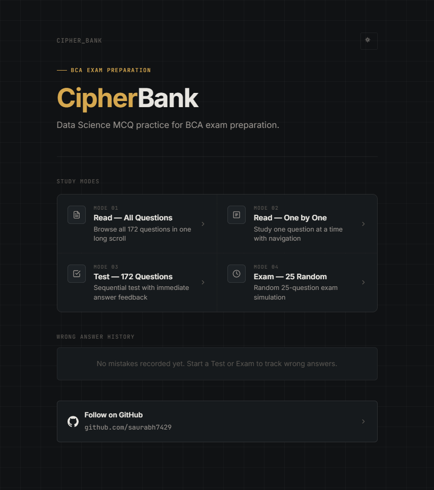
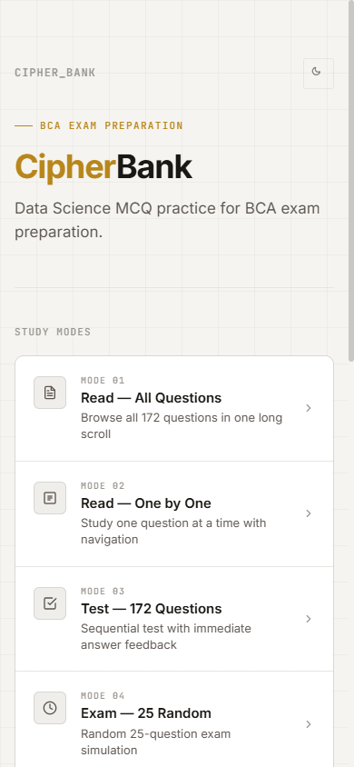

# 🧠 CipherBank — Data Science MCQ QuizHub (Semester V)

> A modern, mobile-first single-page study application for **Data Science BCA Semester-V Exam Preparation** featuring **172 curated MCQs** across 4 study modes.

---

## 📱 Previews

<div align="center">
  
  <br/>
  
</div>

---

## ✨ Features

- **172 Verified Questions**: Complete syllabus coverage for BCA Semester V Data Science course.
- **4 Dedicated Study Modes**:
  1. **Mode 01 — Read All Questions**: Long scroll view of all 172 questions with tap-to-reveal answers.
  2. **Mode 02 — Read One by One**: Focused single-question flashcard study with smooth navigation.
  3. **Mode 03 — Test (172 Questions)**: Sequential test with locked answers, immediate feedback, and real-time score tracking.
  4. **Mode 04 — Exam (25 Random)**: Realistic 25-question mock exam with editable choices, question map overlay, and final score report.
- **Wrong Answer History**: Automatically logs missed questions to `localStorage` so you can review and practice weak areas anytime.
- **Mobile-First Responsive Design**: Built specifically for mobile devices with `100dvh`, 44px touch targets, safe-area inset clearance, and floating navigation bars.
- **Dark & Light Mode**: Built-in sleek dark theme (Amber Gold + Muted Cyan) and crisp light theme with instant toggle.
- **Zero Backend / 100% Client-Side**: Pure Vanilla HTML5, CSS3, and modern JavaScript — works entirely offline once loaded.
- **Full Accessibility (a11y)**: Semantic HTML, ARIA live regions, keyboard navigation (arrow keys), and high contrast color ratios.

---

## 🚀 Deployment on GitHub Pages

Since CipherBank has **zero build steps** and no server backend, it runs directly on **GitHub Pages** for free!

### Quick Steps:

1. **Push your code to GitHub**:
   ```bash
   git add .
   git commit -m "Initial commit: Data Science QuizHub app"
   git push origin main
   ```

2. **Enable GitHub Pages**:
   - Go to your repository on GitHub (`https://github.com/saurabh7429/DataScience-QuizHub-Sem-V`).
   - Click on **Settings** (tab at the top right).
   - In the left sidebar under *Code and automation*, click **Pages**.
   - Under **Build and deployment**:
     - **Source**: Select `Deploy from a branch`.
     - **Branch**: Select `main` branch and `/ (root)` folder.
   - Click **Save**.

3. **Visit Your Live Site**:
   - After 1–2 minutes, GitHub will publish your site at:
     ```
     https://saurabh7429.github.io/DataScience-QuizHub-Sem-V/
     ```

---

## 💻 Running Locally

Because the application fetches the question dataset via JavaScript `fetch()`, run it using any local static HTTP server:

### Option A: Using npx serve (Node.js)
```bash
npx -y serve .
```

### Option B: Using Python
```bash
# Python 3
python -m http.server 3000
```

### Option C: Using VS Code Live Server
- Open the project in VS Code.
- Right-click `index.html` → **Open with Live Server**.

Then visit `http://localhost:3000` in your browser.

---

## 📁 Repository Structure

```
├── index.html                           # Main application shell
├── styles.css                           # CSS custom property design system & layout
├── app.js                               # Core application logic & state management
├── data/
│   └── QB-DataScience_withAnswers.json  # 172-question verified dataset
├── Questions/                           # Source PDF syllabus question banks
│   ├── Data science MCQs.pdf
│   └── Data_Science_All_Units_MCQ_Question_Answer.pdf
├── assets/
│   ├── github.svg                       # GitHub profile icon
│   └── screenshots/                     # UI preview screenshots
├── .gitignore                           # Git ignore rules
└── README.md                            # Documentation
```

---

## 📊 Dataset Format

The dataset in `data/QB-DataScience_withAnswers.json` conforms to the following schema:

```json
{
  "title": "Data Science — 172 MCQ Final Answer Key",
  "total_questions": 172,
  "questions": [
    {
      "id": 1,
      "unit": "Unit 1: Introduction to Data Science",
      "section": "What is Data Science",
      "question": "What is the primary goal of data science?",
      "options": {
        "A": "To collect data",
        "B": "To analyze data",
        "C": "To extract insights from data",
        "D": "To visualize data"
      },
      "correct_option": "C",
      "correct_answer": "To extract insights from data"
    }
  ]
}
```

---

## 👤 Author

Developed by **[saurabh7429](https://github.com/saurabh7429)**  
BCA Semester V — Data Science Preparation Tool
